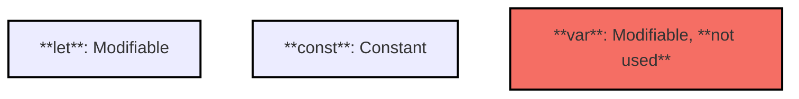
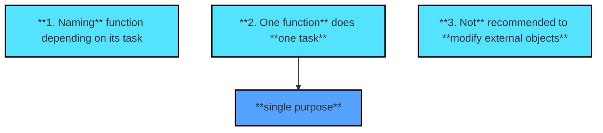
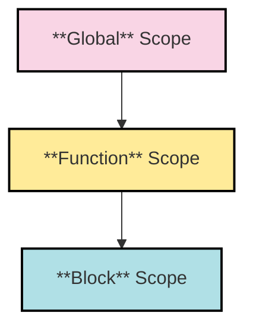
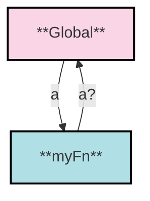
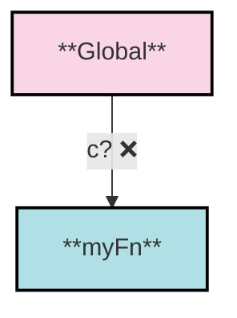
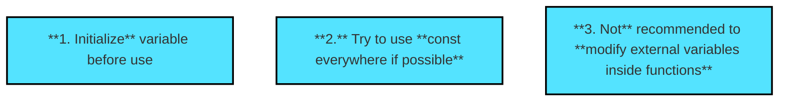
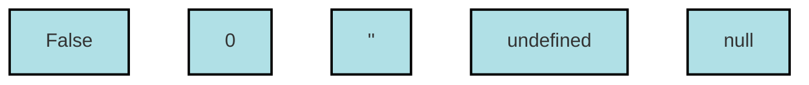

># These are my notes about JS

***

# Variables

Variable allows **repeated** access to **values**

## How to Name Variables

- **<u>P</u>ascal<u>C</u>ase**: used for **Types** and **Classes**.
- **DB_PASSWORD**: used for values **known before the launch** of an app/program and are **unchangable**.
- **<u>c</u>amel<u>C</u>ase**: used for **variables**

Variable names should be **understandable**. (Bad examples: ~~foo, bar, test, xyz~~)

## Type system

- **Static** - Variable type is determined in code with **_keywords_** and **is checked by compiler**. Languages that use Static typing: **C++, C, Java**

- **Dynamic** - Variable type is determined by its **_value_** in the **moment of code execution**. Languages that use Dynamic typing: **JS, Python**

## Object Types

### Primitive Types

These types are stored **directly in the variable** and hold their actual values. When you assign a primitive type to a variable, it contains the value itself. If you copy a primitive value to another variable, you create a separate copy.

These types are:

- String
- Boolean
- Number
- Null
- Undefined
- Symbol

### Reference Types

These types are stored **as references to their values**. When you assign a reference type to a variable, the variable holds a reference (or a pointer) to the location in memory where the value is stored. If you **_copy_** a reference type to another variable, **both variables point to the same object in memory**.

These types are:

- Object
- Array
- Function

## Variable initializing



There's two ways to initialize a variable:

- **Initializing** (`let a`): permitted only for modifiable variables.
- **Initializing and assigning** (`const c=10`): the only way to initialize a constant variable. If tried to use only **initializing**, it will throw a SyntaxError: Missing initializer in const declaration.

***

# Objects

In JavaScript, Objects are a _fundamental data structure_ and a key part of the language. Objects are used to represent complex data structures. They can be **used for everything** from simple data containers to more complex entities (like functions, arrays, and even custom types).

## Objects can be

- ### Collections of key-value pairs

Objects are collections of **key-value** pairs, where each key is a property name, and each value can be any data type (e.g., numbers, strings, functions, or even other objects). The **syntax** is: `propertyName: propertyValue`

- ### Almost all things in JS

In JavaScript, **_nearly everything_** that isn’t a primitive type is an object (e.g., arrays, functions, dates, and even errors). Objects are flexible and form the foundation of many JavaScript features.

- ### Reference Type variables

Objects are a type of reference variable. Unlike primitive data types, which store their values directly, objects store a reference to the location in memory where the data is kept. This means that when you assign or copy an object, you’re working with references to the same data.

## Object Creation

Object can be made through:

- ## Object Literal `{}`

The **simplest and most common way** to create an object is by using object literal syntax.

Syntax:

```js
let objectName = {
  property1: value1,
  property2: value2
};
```

- ## `new`

This approach is less common but useful if you’re **dynamically adding properties** after creating the object.

Syntax:

```js
let objectName = new Object();
```

##

There're more ways to make an Object, but these are most common in JS.

> Order of elements in an Object _doesn't_ matter

## Accessing Object Properties

In JavaScript, you can access and interact by **adding**, **editing** or **removing** an object's properties using two main syntaxes: **Dot Notation** and **Bracket Notation**. Each has its own use cases and advantages.

### Dot Notation

Dot Notation is the simpler and more common way to access properties. It's **straightforward and visually cleaner**, making code easy to read.

**Pros**:

- Dot notation is best when you know the **exact name of the property** and it follows standard variable naming rules (e.g., it doesn’t start with a number and **contains no spaces or special characters**).

- It’s generally preferred **when you have control over the property names** because it’s more _concise_ and _readable_.

**Cons**:

Dot notation cannot be used if:

- The property name contains **spaces** (`person["first name"]`).
- The property name starts with a **number** (`person["123name"]`).
- The property name is stored in a variable and **not known ahead of time**.

### Bracket Notation

Bracket Notation is more versatile, allowing you to access properties using dynamic expressions or property names that **don’t follow standard naming conventions**.

**Pros**:

- Bracket notation is flexible and **allows access to properties with names that contain spaces, special characters, or numbers** (e.g., `person["first name"]` or `person["123name"]`).
- It is ideal for **dynamic property access**, where the property name might be stored in a variable or created at runtime.
- Useful when iterating over an object's properties with a loop, especially if property names are not known ahead of time.

**Cons**:

- Bracket notation can be **less concise and readable** than dot notation, especially when accessing simple properties.
- It’s **more prone to errors if the property name in quotes is misspelled**, as there’s **no auto-completion support in many editors**.
- Requires **explicit quotation marks** around property names, which can sometimes make the code look cluttered.

### Summary

| Feature | Dot Notation | Bracket Notation |
| :- | :-: | :-: |
| Simple Syntax | ✅ | ❌ |
| Dynamic Access | ❌ | ✅ |
| Special Characters | ❌ | ✅ |
| Variable Properties | ❌ | ✅ |

## Interacting with Object Properties

Here's an example object:

```js
const myCity = {
  city: 'New York',
  popular: true,
}
```

### Adding

To add a new property to an object, use either dot notation or bracket notation. If the property doesn’t already exist, it will be added to the object.

```js
// dot notation
myCity.country = 'USA'
// bracket notation
myCity['country'] = 'USA'
console.log(myCity) // Output: { city: "New York", popular: true, country: 'USA' }  
```

> Properties **are placed in the order in which they were added**, unless they are assigned by numbers:

```js
let example = {};
example.b = "second";
example.a = "first";
example[2] = "number two";
example[1] = "number one";

console.log(example); // { 1: "number one", 2: "number two", b: "second", a: "first" }
```

### Editing

Editing a property's value is the same as adding it — if the property already exists, **assigning a new value will update it**.

```js
// dot notation
myCity.city = 'Las Vegas'
// bracket notation
myCity['city'] = 'Las Vegas'
console.log(myCity) // Output: { city: "Las Vegas", popular: true, country: 'USA' } 
```

### Deleting

To remove a property, **use the `delete` operator**, followed by dot notation or bracket notation. This will permanently **remove the property from the object**.

```js
// dot notation
delete myCity.country
// bracket notation
delete myCity['country']
console.log(myCity) // Output: { city: "Las Vegas", popular: true } 
```

### Use of variables

If there're variables outside the object that have **exact same name as your property, it can be simplified**.

Instead of this:

```js
const name = 'Alex'
const postsQty = 23

const userProfile = {
  name: name,
  postsQty: postsQty,
  hasSignedAgreement: false
}
```

It can be written like this:

```js
const name = 'Alex'
const postsQty = 23

const userProfile = {
  name,
  postsQty,
  hasSignedAgreement: false
}
```

It is recommended to place **simplified properties at the beginning** of the object

***

# Global Objects

In JavaScript, global objects are objects that provide a **global scope** where properties, functions, and variables can be accessed from anywhere in the code. The global object **varies depending on the environment** (like a web browser or Node.js). Here’s a look at the main global objects and how they work:

### `window`

**In web browsers**, the global object is called `window`. It **represents the browser's window** in which your script runs. The window object provides a range of properties and methods for **controlling the browser, interacting with the Document Object Model (DOM), and accessing global variables and functions.**

### `global`

**In Node.js**, the global object is called `global`. Unlike browsers, **Node.js does not have a window object**. The global object in Node.js has similar functionality, allowing you to **define variables, functions, or classes that should be accessible across the entire environment.**

### `globalThis`

Introduced in **ECMAScript 2020**, `globalThis` provides a **universal** way to access the global object **across different environments** (like browsers, Node.js, and others). `globalThis` refers to the global object regardless of where the code runs, making it a more standardized way to write cross-platform JavaScript.

Using `globalThis` is particularly helpful **when writing code that runs in both browsers and Node.js**, as it provides a consistent way to access the global scope across different environments.

## Properties

It is possible to call properties of global objects **without needing to use dot notation with `window`, `global`, or `globalThis`.**

| Full Syntax                              | Simplified Syntax   |
| :--------------------------------------- | :------------------: |
| `window.console.log(10)`<br>`global.console.log(10)`<br>`globalThis.console.log(10)` | `console.log(10)` |

***

# Methods

A method is a **property** of an object, which's value is a **function**.

## Methods VS Properties

| `myCity.city`| `myCity.cityGreeting()` |
| :-: | :-: |
| **Accessing value** of a property* | **Calling** a function |

***Accessing value** of a **method** returns its **structure**.

>If a property that **isn't a method/function is called**, an **error** is thrown: `TypeError: ... is not a function`

***

# JSON

JSON (**<u>J</u>ava <u>S</u>cript <u>O</u>bject <u>N</u>otation**) is a format of **exchange data between computers** over the Web.

Examples of data represented in JSON:

- _CSS style tables_

- _Images_

- _Text files_

## JSON Notation

### Object Notation

JSON objects are commonly used in JavaScript to create objects and are suitable for **_human_** readability. They are often referred to as **parsed JSON** when processed in JavaScript.

**Syntax Example:**

```js
{
  "userId":1,
  "id":1,
  "title":"Test Title",
  "Status":{
    "completed": false
  }
}
```

### String Notation

JSON in string form is typically used for **_computer_** readability. It is often referred to as **stringified JSON** It is often the format that is transferred between systems, and it must be parsed into an object for use in JavaScript.

**Syntax:**

```js
{"userId":1, "id":1, "title":"Test Title", "Status":{"completed": false}}
```

## Methods

`JSON.parse()`: Transforms **JSON string** into a **JS object**.

`JSON.stringify()`: Transforms **JS object** into a **JSON string**.

***

# Mutation in JS

In JavaScript, **mutation** refers to **changing the state or value of an object or array**. Unlike **primitive values** (such as numbers, strings, and booleans), which are **immutable** (meaning they cannot be changed directly), **objects and arrays are mutable**, meaning their properties and elements **can be altered**.

## Mutating Object

In an object, properties and elements can be **mutated by editing, adding or removing** properties.

### Examples

**_Editing_ property mutation:**

```js
const person = { name: 'Alice', age: 25 };
person.age = 26;  // Mutating the 'age' property of the object
console.log(person.age);  // Output: 26
```

**_Adding_ and _removing_ property mutation:**

```js
const user = { name: 'John' };
user.age = 30;  // Adding a new property to the object
console.log(user);  // Output: { name: 'John', age: 30 }

delete user.name;  // Removing a property from the object
console.log(user);  // Output: { age: 30 }
```

## Mutating Array

Same as in an object, array can be **mutated by editing, adding and removing** elements and changing array's **length**.

### Examples

**_Editing_ and _adding_ property mutation:**

```js
const numbers = [1, 2, 3];
numbers[0] = 10;  // Mutating the first element of the array
console.log(numbers);  // Output: [10, 2, 3]

numbers.push(4);  // Adding an element to the array
console.log(numbers);  // Output: [10, 2, 3, 4]
```

**Editing array _length_ mutation:**

```js
const fruits = ['apple', 'banana', 'cherry'];
fruits.length = 2;  // Mutating the array by shortening it
console.log(fruits);  // Output: ['apple', 'banana']
```

## Mutation Functions*

In JavaScript, when you pass an object or an array to a **function**, the function has **access to the original object or array** (because objects and arrays are **passed by reference**). If the function mutates the object or array, the **changes will be reflected outside the function as well.**

**Example:**

```js
function updateName(person) {
  person.name = 'Bob';  // Mutating the object
}

const person = { name: 'Alice' };
updateName(person);
console.log(person.name);  // Output: Bob
```

## Avoiding Mutations

Example object for this section:

```js
const person = {
  name: 'Bob',
  age: 21
}
```

### `Object.assign({}, person)`

`assign` - creates a **new** object.
`{}` - **writes the value**.
`person` - object that needs to be copied.

> Con: **Embedded references are still copied.**

### `= {...person}`

`{______}` - creates a new object.
`...` - **`Spread`** operator, separating object on properties
`person` - object that needs to be copied.

> Con: **Embedded references are still copied.**

### `JSON.parse(JSON.stringify(person))`

`JSON.stringify(person)` - Converts the `person` _object to a JSON string_.
`JSON.parse()` - Parses the _JSON string back into a **new** object_.

> Pro: Embedded references are **NOT** copied.
> Con: **Does not preserve functions or non-JSON data types** (like `undefined`, `RegExp`, or `Date`).

## Summary

| Avoid method | Embedded references?   |
| :----------- | :------------------------: |
| `Object.assign({}, person)` | ☑️ (Shallow copy) |
| `= {...person}` | ☑️ (Shallow copy) |
| `JSON.parse(JSON.stringify(person))` | ❎ (Deep copy, no functions or non-JSON data) |

***

# Functions

Function is a **block of code** that can be used **repeatedly**. **Function is an object**

Functions can be:

- Named/_Anonymous_
- **Assigned to a variable**
- **Argument to another function**
- _Method_

### Syntax/Structure

```js
funtion myFn(a,b){
  let c
  a = a+1
  c = a+b
  return c
}
```

`myFn` - name of the function in **camelCase**.
`a`, `b` - **parameters**, variables in the functions.
`return c` - **result**.

Warning:

- **Function returns `undefined` if does not contain `return`.**
- **It is _not recommended_ to mutate external objects inside functions.**

## Avoiding Mutation Inside Function

Mutation can be avoided by creating object's copy inside the function and returning the copy as a result.

**Examples:**

 **_INCORRECT_** (Mutating the original object):

```js
function increaseAge(person){
  person.age += 1
  return person
}
```

**_CORRECT_** (Creating a copy to avoid mutation):

```js
function increaseAge(person){
  const personUpdate={...person}
  personUpdate.age += 1
  return personUpdate
}
```

## _Callback_ Functions

A **callback function** is **a function that is passed as an argument to another function** and is executed after the completion of some other operation.

**Example:**

```js
function anotherFunction(){
  console.log("Some code here")
}
function fnWithCallback(callbackFunction){
  callbackFunction()
}

fnWithCallback(anotherFunction)
```

## Rules of Working with Functions



***

# Scopes

Scopes define borders of **availability of a variable**.



## Global

Global scope and variables created there are **known throughout all the code.**

## Function

Function scope is... well, in a function and **known inside the function.** `var` variables are function-scoped.

## Block

Block scope is between `{}`. `let` and `const` are block-scoped, meaning they are only accessible inside the block where they are declared.

> Function scope is a block scope, since in its syntax, `function(){}`, there're `{}`.

Statement above is false. Here's an example:

```js
function testFunction() {
  var x = 10;
  if (true) {
    var y = 20; // 'var' is function-scoped, so 'y' is accessible throughout the function
  }
  console.log(x); // 10
  console.log(y); // 20 (accessible here, because 'y' is function-scoped, not block-scoped)
}
```

In the above example, both `x` and `y` are function-scoped, **even though `y` is declared inside a block** (the `if` statement).

### Example

```js
let a
let b

function myFn(){
  let c
}
```

- `myFn` knows `a`, `b`, <u>`c`</u>
- `global` knows `a`, `b`, _





## Rules of Working with Variables



## 'use strict'

To avoid changing variables outside functions, use `'use strict'` syntax.

**Bad example**, where variable is changed inside the function:

```js
function myFn(){
  a=true
  console.log(a)
}
myFn()

console.log(a) // true
```

**`'use strict'` example**:

```js
'use strict'
function myFn(){
  a=true // ReferenceError:
  console.log(a)
}
myFn()

console.log(a) // Normal value of a
```

***

# Operators

An operator is a **built-in** function or *symbol* that performs operations on one or more values. Operators are essential to JavaScript for **calculations, comparisons, logical checks, and value assignments**.

There're many operators, with **5** types:

- Arithmetic
- Comparison
- Logical
- Assignment
- Text

Arithmetic operators:

- `+`  : Addition
- `-`  : Subtraction
- `*`  : Multiplication
- `/` : Division

Comparison operators:

- `==` : Equal to
- `===` : *Strict* Equal to
- `!=` : *Not* Equal to
- `!==` : * Strict Not* Equal to
- `<` : Less than
- `>` : Greater than
- `<=` : Less than or equal to
- `>=` : Greater than or equal to

Logical operators:

- `!` : Not
- `&&` : And
- `||`: Or

> Note: `!` returns boolean, `&&` and `||` return value of one of operands

Assignment operator~~s~~:

- `=` : Assignment
- `+=` : Addition and assignment
- `-=` : Subtraction and assignment
- `*=` : Multiplication and assignment
- `/=` : Division and assignment

Text/String operators:

- `typeof` : Checks data type of variable
- `instanceof` : Checks if a variable is an instance of a specific class
- `new` : Creates a new instance
- `delete` : Deletes an instance
- `...` : Spread/separate object on properties

Operands are values on which the operations make changes.

**Unary** *operators* are operators with only **one** *operand*. **Binary** *operators* are operators with **two** *operands*. **Ternary** *operators* are are operators with only **three** *operands*

## Ways of writing:

**Infix**: between operands

Examples:
- `a = true`
- `a + b`

**Prefix**: before an operand

Examples:
- `++ a`
- `delete obj.a`

**Postfix**: after an operand

Examples:
- `a ++`
- `myFunction()` () is an operation

## False values:

